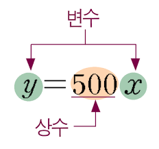

# 1-1 변수와 상수

변수 *variable 와 상수 *constant 는 함수 *function를 이해하기 위해 반드시 알아야 하는 중요한 개념입니다.    
이 개념은 수학뿐만 아니라 프로그래밍에서도 사용합니다.

<br>

```
-정의 
'변수'는 값이 고정되지 않아 다양한 값이 들어갈 수 있다.
'상수'는 값이 고정되어 변하지 않는다.
```



변수는 일종의 '상자'로 비유할 수 있습니다. 그림 1.1.1 에서는 x라는 상자(변수) 안에 2, -1, 1.5 같은 다양한 값이 들어갈 수 있습니다. 상수는 값이 변하지 않는데 여기 예에서는 500과 같이 고정된 값을 가지고 있습니다.

이제 구체적인 예를 하나 들어봅시다.    
x에 대한 1차함수 y =  ax + b가 있다고 가정합시다. 이는 x가 변할 때, y가 어떻게 달라지는지를 알아보는 함수입니다.    
즉, x와 y의 관계를 나타내는 수식입니다. 이 식에서는 x는 다양한 값으로 변할 수 있는 변수에 해당하고, a와 b는 변하지 않고 일정한 값을 가지는 상수에 해당합니다.    
이와 같이 수학셍서는 변수를 표현할 때 x나 y같은 문자를, 상수를 표현할 때엔 a나 b와 같은 문자를 사용하는 경향이 있습니다.    
따라서, 변수는 값의 변화에 주목하며 관심 깊게 살펴야 할 대상이며, 상수는 값이 변하지 않기에 관심을 덜 두어도 되는 대상이라 말할 수 있습니다. 
      
### 인공지능에서 활용하는 것

    - 인공지능 모델로 사용하는 것 중 Neural Network는 '가중치'라는 개념이 있는데, 컴퓨터가 이러한 가중치를 스스로 학습하며 결정하게 됩니다.   
    - 재미있는 것은 컴퓨터가 가중치를 학습할 때는 가중치가 '변수'의 역할을 하는데,    
      학습이 끝나고 해당 가중치를 학습 모델에 활용할 때는 '상수'의 역할을 한다는 것입니다.   
      이처럼 '변수'와 '상수' 는 문제 상황을 바라보는 관점에 따라 달라질 수 있으며,    
      결국 우리가 어떤 것에 관심을 두느냐에 따라 해당하는 역할이 달라지는 것을 알 수 있습니다.
